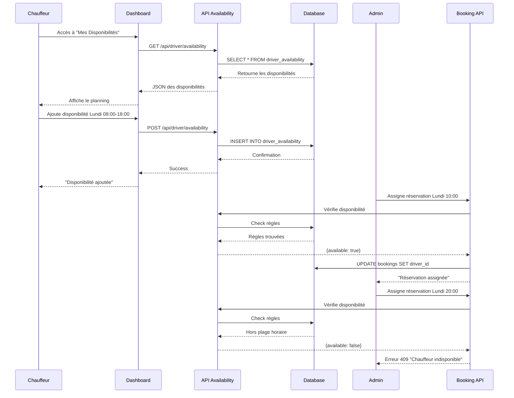

# 🗓️ Système de Gestion des Disponibilités Chauffeurs

## 📋 Vue d'ensemble

Le système permet aux chauffeurs de définir leurs disponibilités et empêche l'assignation de réservations en dehors de ces créneaux horaires.

## 🎯 Fonctionnalités

### 1. Disponibilités Récurrentes
- **Planning hebdomadaire** : Définir les horaires pour chaque jour de la semaine
- **Plages horaires** : Heure de début et de fin
- **Notes** : Ajouter des commentaires

### 2. Disponibilités Spécifiques
- **Dates particulières** : Définir des exceptions pour des dates précises
- **Indisponibilités** : Marquer des absences (congé, rendez-vous, etc.)
- **Priorité** : Les dates spécifiques ont priorité sur les disponibilités récurrentes

### 3. Validation Automatique
- **Vérification en temps réel** lors de l'assignation
- **Avertissement visuel** pour l'administrateur
- **Message d'erreur explicite** si assignation impossible

## 🗄️ Structure de la Base de Données

### Table `driver_availability`

```sql
CREATE TABLE driver_availability (
  id SERIAL PRIMARY KEY,
  driver_id VARCHAR(255) NOT NULL REFERENCES users(id) ON DELETE CASCADE,
  day_of_week INTEGER,           -- 0=Dimanche, 6=Samedi (null si date spécifique)
  start_time VARCHAR(5) NOT NULL, -- Format "HH:mm"
  end_time VARCHAR(5) NOT NULL,   -- Format "HH:mm"
  is_available BOOLEAN DEFAULT true,
  specific_date DATE,             -- Date spécifique (null si récurrent)
  notes TEXT,
  created_at TIMESTAMP DEFAULT NOW(),
  updated_at TIMESTAMP DEFAULT NOW(),
  
  CONSTRAINT check_day_of_week CHECK (day_of_week IS NULL OR (day_of_week >= 0 AND day_of_week <= 6)),
  CONSTRAINT check_time_format CHECK (start_time ~ '^([0-1][0-9]|2[0-3]):[0-5][0-9]$' AND end_time ~ '^([0-1][0-9]|2[0-3]):[0-5][0-9]$')
);

CREATE INDEX idx_driver_availability_driver ON driver_availability(driver_id);
CREATE INDEX idx_driver_availability_date ON driver_availability(specific_date);
CREATE INDEX idx_driver_availability_day ON driver_availability(day_of_week);
```

## 🔧 Installation

### Étape 1 : Exécuter la migration

```bash
# Connexion à la base de données
psql $DATABASE_URL

# Exécuter le fichier de migration
\i migrations/create-driver-availability.sql
```

### Étape 2 : Vérifier la création

```sql
-- Vérifier la table
\d driver_availability

-- Vérifier les données initiales
SELECT * FROM driver_availability;
```

## 📂 Architecture des Fichiers

### Backend

```
src/
├── schema.ts                                          # Définition Drizzle ORM
├── lib/
│   └── driver-availability.ts                        # Fonctions utilitaires
└── app/api/driver/availability/
    ├── route.ts                                       # CRUD API (GET, POST, PUT, DELETE)
    └── check/
        └── route.ts                                   # API de vérification
```

### Frontend

```
src/components/
├── driver/
│   └── DriverAvailabilityManager.tsx                 # Composant pour le chauffeur
└── admin/
    └── DriverAvailabilityWarning.tsx                 # Avertissement pour l'admin
```

## 🔌 API Endpoints

### 1. GET `/api/driver/availability`
Récupérer les disponibilités d'un chauffeur

**Query Params:**
- `driverId` (optionnel pour admin/manager)

**Response:**
```json
{
  "success": true,
  "data": [
    {
      "id": 1,
      "driverId": "123",
      "dayOfWeek": 1,
      "startTime": "08:00",
      "endTime": "18:00",
      "isAvailable": true,
      "specificDate": null,
      "notes": null
    }
  ]
}
```

### 2. POST `/api/driver/availability`
Créer une nouvelle disponibilité

**Body:**
```json
{
  "dayOfWeek": 1,           // 0-6 ou null
  "startTime": "08:00",     // Format HH:mm
  "endTime": "18:00",       // Format HH:mm
  "isAvailable": true,
  "specificDate": null,     // "YYYY-MM-DD" ou null
  "notes": "Congé"
}
```

### 3. PUT `/api/driver/availability`
Modifier une disponibilité existante

**Body:**
```json
{
  "id": 1,
  "dayOfWeek": 1,
  "startTime": "09:00",
  "endTime": "17:00",
  "isAvailable": false,
  "specificDate": "2024-12-25",
  "notes": "Noël - Indisponible"
}
```

### 4. DELETE `/api/driver/availability?id=1`
Supprimer une disponibilité

### 5. GET `/api/driver/availability/check`
Vérifier la disponibilité d'un chauffeur

**Query Params:**
- `driverId`: ID du chauffeur
- `scheduledDateTime`: Date/heure ISO 8601

**Response:**
```json
{
  "success": true,
  "available": false,
  "message": "Le chauffeur n'est pas disponible le Lundi 25/12/2024 à 10:00 (Noël - Indisponible)"
}
```

## 🎨 Intégration Frontend

### Dashboard Chauffeur

```tsx
import { DriverAvailabilityManager } from '@/components/driver/DriverAvailabilityManager'

export default function DriverDashboard() {
  return (
    <div>
      <h1>Mon Tableau de Bord</h1>
      <DriverAvailabilityManager />
    </div>
  )
}
```

### Interface d'Assignation Admin

```tsx
import { DriverAvailabilityWarning } from '@/components/admin/DriverAvailabilityWarning'

export default function AssignBooking() {
  const [selectedDriver, setSelectedDriver] = useState<string | null>(null)
  const [scheduledDate, setScheduledDate] = useState<string | null>(null)
  const [canAssign, setCanAssign] = useState(true)

  return (
    <div>
      <select onChange={(e) => setSelectedDriver(e.target.value)}>
        {/* Options chauffeurs */}
      </select>
      
      <input 
        type="datetime-local" 
        onChange={(e) => setScheduledDate(e.target.value)}
      />

      <DriverAvailabilityWarning
        driverId={selectedDriver}
        scheduledDate={scheduledDate}
        onAvailabilityChange={(available, message) => {
          setCanAssign(available)
          if (!available) {
            console.warn('Chauffeur indisponible:', message)
          }
        }}
      />

      <button disabled={!canAssign}>
        Assigner
      </button>
    </div>
  )
}
```

## 🧪 Tests

### Test 1 : Créer une disponibilité récurrente

```javascript
// Via API
fetch('/api/driver/availability', {
  method: 'POST',
  headers: { 'Content-Type': 'application/json' },
  body: JSON.stringify({
    dayOfWeek: 1, // Lundi
    startTime: "08:00",
    endTime: "18:00",
    isAvailable: true
  })
})
```

### Test 2 : Marquer une indisponibilité spécifique

```javascript
fetch('/api/driver/availability', {
  method: 'POST',
  headers: { 'Content-Type': 'application/json' },
  body: JSON.stringify({
    specificDate: "2024-12-25",
    startTime: "00:00",
    endTime: "23:59",
    isAvailable: false,
    notes: "Congé de Noël"
  })
})
```

### Test 3 : Vérifier la disponibilité

```javascript
const driverId = "cm4kxgpkw00008rqq7cgtfgzi"
const date = "2024-12-25T10:00:00"

fetch(`/api/driver/availability/check?driverId=${driverId}&scheduledDateTime=${date}`)
  .then(res => res.json())
  .then(data => {
    console.log('Disponible:', data.available)
    console.log('Message:', data.message)
  })
```

### Test 4 : Tentative d'assignation

```javascript
// L'API d'assignation vérifie automatiquement
fetch('/api/admin/bookings/123/assign', {
  method: 'POST',
  headers: { 'Content-Type': 'application/json' },
  body: JSON.stringify({
    driverId: "cm4kxgpkw00008rqq7cgtfgzi",
    scheduledDate: "2024-12-25T10:00:00"
  })
})
// Retourne 409 si indisponible
```

## 📊 Logique de Vérification

### Algorithme de `checkDriverAvailability()`

```
1. Extraire jour de la semaine et heure de la date demandée
2. Chercher une disponibilité SPÉCIFIQUE pour cette date exacte
   └─ Si trouvée : retourner son statut (disponible/indisponible)
3. Si pas de date spécifique, chercher disponibilité RÉCURRENTE pour ce jour
   └─ Vérifier que l'heure demandée est dans la plage horaire
4. Si aucune règle trouvée : considérer comme INDISPONIBLE par défaut
```

### Priorités

1. **Date spécifique** > **Récurrent**
2. **Indisponibilité explicite** > **Disponibilité par défaut**

### Exemples

#### Exemple 1 : Disponibilité standard
```
Règle : Lundi 08:00-18:00, disponible
Demande : Lundi 10:00
Résultat : ✅ Disponible
```

#### Exemple 2 : Heure en dehors
```
Règle : Lundi 08:00-18:00, disponible
Demande : Lundi 20:00
Résultat : ❌ "Le chauffeur n'est disponible que de 08:00 à 18:00"
```

#### Exemple 3 : Congé spécifique
```
Règle 1 : Lundi 08:00-18:00, disponible (récurrent)
Règle 2 : 25/12/2024 00:00-23:59, indisponible (spécifique)
Demande : 25/12/2024 10:00
Résultat : ❌ "Le chauffeur n'est pas disponible le Lundi 25/12/2024 (Congé de Noël)"
```

#### Exemple 4 : Pas de règle
```
Pas de règle pour Dimanche
Demande : Dimanche 10:00
Résultat : ❌ "Le chauffeur n'a pas défini de disponibilité pour ce créneau"
```

## 🚨 Gestion des Erreurs

### Erreur 400 : Données invalides
```json
{
  "success": false,
  "error": "dayOfWeek doit être entre 0 et 6"
}
```

### Erreur 403 : Permissions insuffisantes
```json
{
  "success": false,
  "error": "Non autorisé"
}
```

### Erreur 404 : Disponibilité non trouvée
```json
{
  "success": false,
  "error": "Disponibilité non trouvée"
}
```

### Erreur 409 : Chauffeur indisponible
```json
{
  "success": false,
  "error": "Le chauffeur n'est pas disponible à cette date",
  "code": "DRIVER_NOT_AVAILABLE",
  "details": {
    "available": false,
    "message": "Le chauffeur n'est pas disponible le Lundi 25/12/2024 à 10:00 (Congé de Noël)"
  }
}
```

## 📝 Permissions

- **Chauffeur** : CRUD sur ses propres disponibilités uniquement
- **Admin/Manager** : Lecture de toutes les disponibilités
- **Client** : Aucun accès

## 🔄 Workflow Complet



## ✅ Checklist de Déploiement

- [ ] Exécuter la migration SQL
- [ ] Vérifier la création de la table
- [ ] Tester les API endpoints
- [ ] Intégrer le composant dans le dashboard chauffeur
- [ ] Intégrer l'avertissement dans l'interface admin
- [ ] Tester le workflow complet
- [ ] Documenter pour les utilisateurs

## 📚 Documentation Utilisateur

### Pour les Chauffeurs

1. **Accéder à "Mes Disponibilités"** dans votre dashboard
2. **Cliquer sur "+ Ajouter une disponibilité"**
3. **Choisir le type** :
   - Disponibilité récurrente (chaque semaine)
   - Date spécifique (pour exceptions)
4. **Définir les horaires** de début et fin
5. **Marquer comme disponible ou indisponible**
6. **Ajouter des notes** si nécessaire

### Pour les Administrateurs

- Un **avertissement apparaît** lors de l'assignation si le chauffeur est indisponible
- Vous pouvez **quand même assigner** mais le chauffeur devra être contacté
- Les **disponibilités sont vérifiées en temps réel**

## 🎉 Résultat Final

- ✅ Chauffeurs autonomes dans la gestion de leur planning
- ✅ Validation automatique lors des assignations
- ✅ Avertissements clairs pour les administrateurs
- ✅ Flexibilité avec disponibilités récurrentes ET spécifiques
- ✅ Messages d'erreur explicites avec détails

---

**Version:** 1.0  
**Date:** 2024  
**Auteur:** NavetteXpress Development Team
